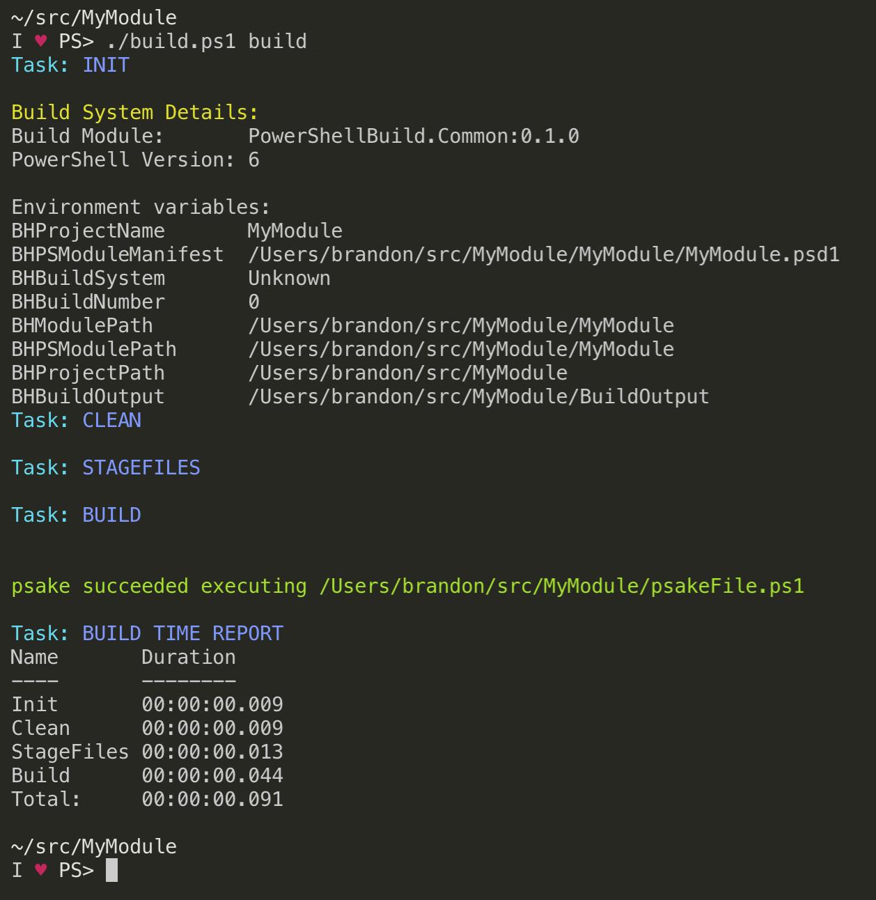
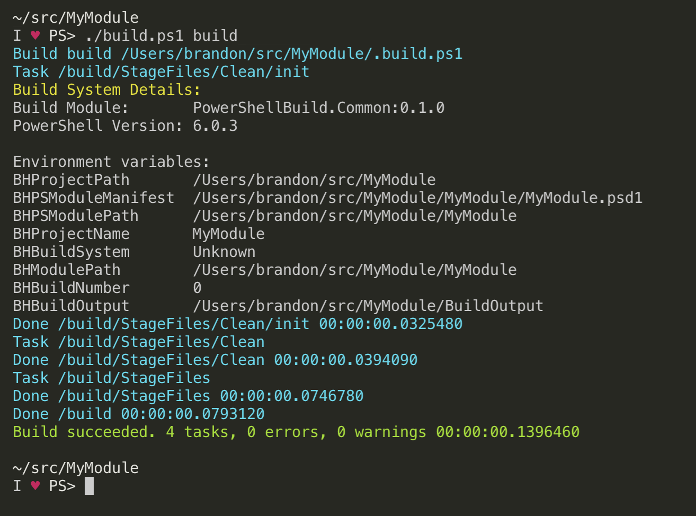

# PowerShellBuild

| GitHub Actions                                                                                                                                        | PS Gallery                                          | License                              |
|-------------------------------------------------------------------------------------------------------------------------------------------------------|-----------------------------------------------------|--------------------------------------|
| [![GitHub Actions Status][github-actions-badge]][github-actions-build] [![GitHub Actions Status][github-actions-badge-publish]][github-actions-build] | [![PowerShell Gallery][psgallery-badge]][psgallery] [![PowerShell Gallery][psgallery-version]][psgallery] [![PowerShell Gallery][psgallery-platforms]][psgallery] | [![License][license-badge]][license] |

This project aims to provide common [psake](https://github.com/psake/psake) and
[Invoke-Build](https://github.com/nightroman/Invoke-Build) tasks for building,
testing, and publishing PowerShell modules.

Using these shared tasks reduces the boilerplate scaffolding needed in most
PowerShell module projects and help enforce a consistent module structure. This
consistency ultimately helps the community in building high-quality PowerShell
modules.

> If using [psake](https://github.com/psake/psake) as your task runner, version
> `5.0.4` or greater is required. To install psake you can run:

```powershell
Install-Module -Name psake -MinimumVersion 5.0.4 -Repository PSGallery
```

> For [Invoke-Build](https://github.com/nightroman/Invoke-Build), see the
> [how to dot source tasks using PowerShell aliases](https://github.com/nightroman/Invoke-Build/blob/master/Tasks/Import/README.md#example-2-import-from-a-module-with-tasks)
> example.

<p align="center">
    
</p>

## Status - Work in progress

> This project is a **work in progress** and may change significantly before
> reaching stability based on feedback from the community. **Please do not base
> critical processes on this project** until it has been further refined.

## Tasks

**PowerShellBuild** is a PowerShell module that provides helper functions to
handle the common build, test, and release steps typically found in PowerShell
module projects. These steps are exposed as a set of
[psake](https://github.com/psake/psake) tasks found in
[psakeFile.ps1](./PowerShellBuild/psakeFile.ps1) in the root of the module, and
as PowerShell aliases which you can dot source if using
[Invoke-Build](https://github.com/nightroman/Invoke-Build). In psake `v4.8.0`, a
feature was added to reference shared psake tasks distributed within PowerShell
modules. This allows a set of tasks to be versioned, distributed, and called by
other projects.

### Primary Tasks

These primary tasks are the main tasks you'll typically call as part of
PowerShell module development.

| Name    | Dependencies          | Description                                     |
|---------|-----------------------|-------------------------------------------------|
| Init    | _none_                | Initialize psake and task variables             |
| Clean   | init                  | Clean output directory                          |
| Build   | StageFiles, BuildHelp | Clean and build module in output directory      |
| Analyze | Build                 | Run PSScriptAnalyzer tests                      |
| Pester  | Build                 | Run Pester tests                                |
| Test    | Analyze, Pester       | Run combined tests                              |
| Publish | Test                  | Publish module to defined PowerShell repository |
| Sign    | SignCatalog           | Sign module files and catalog (meta task)       |

### Secondary Tasks

These secondary tasks are called as dependencies from the primary tasks but may
also be called directly.

| Name                  | Dependencies                   | Description                      |
|-----------------------|--------------------------------|----------------------------------|
| BuildHelp             | GenerateMarkdown, GenerateMAML | Build all help files             |
| StageFiles            | Clean                          | Build module in output directory |
| GenerateMarkdown      | StageFiles                     | Build markdown-based help        |
| GenerateMAML          | GenerateMarkdown               | Build MAML help                  |
| GenerateUpdatableHelp | BuildHelp                      | Build updatable help cab         |
| SignModule            | Build                          | Authenticode-sign module files   |
| BuildCatalog          | SignModule                     | Build module catalog (.cat) file |
| SignCatalog           | BuildCatalog                   | Authenticode-sign the catalog    |

## Task customization

The psake and Invoke-Build tasks can be customized by overriding the values
contained in the `$PSBPreference` hashtable. defined in the psake file. These
settings govern if certain tasks are executed or set default paths used to build
and test the module. You can override these in either psake or Invoke-Build to
match your environment.

| Setting                                                     | Default value                               | Description                                                                                                                                                                  |
|-------------------------------------------------------------|---------------------------------------------|------------------------------------------------------------------------------------------------------------------------------------------------------------------------------|
| $PSBPreference.General.ProjectRoot                          | `$env:BHProjectPath`                        | Root directory for the project                                                                                                                                               |
| $PSBPreference.General.SrcRootDir                           | `$env:BHPSModulePath`                       | Root directory for the module                                                                                                                                                |
| $PSBPreference.General.ModuleName                           | `$env:BHProjectName`                        | The name of the module. This should match the basename of the PSD1 file                                                                                                      |
| $PSBPreference.General.ModuleVersion                        | `\<computed>`                               | The version of the module                                                                                                                                                    |
| $PSBPreference.General.ModuleManifestPath                   | `$env:BHPSModuleManifest`                   | Path to the module manifest (PSD1)                                                                                                                                           |
| $PSBPreference.Build.OutDir                                 | `$projectRoot/Output`                       | Output directory when building the module                                                                                                                                    |
| $PSBPreference.Build.ModuleOutDir                           | `$outDir/$moduleName/$moduleVersion`        | `For internal use only. Do not overwrite. Use '$PSBPreference.Build.OutDir' to set output directory`                                                                         |
| $PSBPreference.Build.CompileModule                          | `$false`                                    | Controls whether to "compile" module into single PSM1 or not                                                                                                                 |
| $PSBPreference.Build.CompileDirectories                     | `@('Enum', 'Classes', 'Private', 'Public')` | List of directories to "compile" into monolithic PSM1. Only valid when `$PSBPreference.Build.CompileModule` is `$true`.                                                      |
| $PSBPreference.Build.CopyDirectories                        | `@()`                                       | List of directories to copy "as-is" to built module                                                                                                                          |
| $PSBPreference.Build.CompileHeader                          | `<empty>`                                   | String that appears at the top of your compiled PSM1 file                                                                                                                    |
| $PSBPreference.Build.CompileFooter                          | `<empty>`                                   | String that appears at the bottom of your compiled PSM1 file                                                                                                                 |
| $PSBPreference.Build.CompileScriptHeader                    | `<empty>`                                   | String that appears in your compiled PSM1 file before each added script                                                                                                      |
| $PSBPreference.Build.CompileScriptFooter                    | `<empty>`                                   | String that appears in your compiled PSM1 file after each added script                                                                                                       |
| $PSBPreference.Build.Exclude                                | `<empty>`                                   | Array of files (regular expressions) to exclude when building module                                                                                                         |
| $PSBPreference.Test.Enabled                                 | `$true`                                     | Enable/disable Pester tests                                                                                                                                                  |
| $PSBPreference.Test.RootDir                                 | `$projectRoot/tests`                        | Directory containing Pester tests                                                                                                                                            |
| $PSBPreference.Test.OutputFile                              | `$projectRoot/testResults.xml`              | Output file path Pester will save test results to                                                                                                                            |
| $PSBPreference.Test.OutputFormat                            | `NUnitXml`                                  | Test output format to use when saving Pester test results                                                                                                                    |
| $PSBPreference.Test.ScriptAnalysis.Enabled                  | `$true`                                     | Enable/disable use of PSScriptAnalyzer to perform script analysis                                                                                                            |
| $PSBPreference.Test.ScriptAnalysis.FailBuildOnSeverityLevel | `Error`                                     | PSScriptAnalyzer threshold to fail the build on                                                                                                                              |
| $PSBPreference.Test.ScriptAnalysis.SettingsPath             | `./ScriptAnalyzerSettings.psd1`             | Path to the PSScriptAnalyzer settings file                                                                                                                                   |
| $PSBPreference.Test.CodeCoverage.Enabled                    | `$false`                                    | Enable/disable Pester code coverage reporting                                                                                                                                |
| $PSBPreference.Test.CodeCoverage.Threshold                  | `.75`                                       | Fail Pester code coverage test if below this threshold                                                                                                                       |
| $PSBPreference.Test.CodeCoverage.Files                      | `@()`                                       | Files to perform code coverage analysis on                                                                                                                                   |
| $PSBPreference.Test.CodeCoverage.OutputFile                 | `$projectRoot/codeCoverage.xml`             | Output file path where Pester will save code coverage results to. A relative path resolves against the Pester test directory.                                                |
| $PSBPreference.Test.CodeCoverage.OutputFileFormat           | `JaCoCo`                                    | Test output format to use when saving Pester code coverage results                                                                                                           |
| $PSBPreference.Test.ImportModule                            | `$false`                                    | Import module from output directory prior to running Pester tests                                                                                                            |
| $PSBPreference.Test.SkipRemainingOnFailure                  | `None`                                      | Skip remaining tests after failure for selected scope. Options are None, Run, Container and Block.                                                                           |
| $PSBPreference.Test.OutputVerbosity                         | `Detailed`                                  | Set verbosity of output. Options are None, Normal, Detailed and Diagnostic.                                                                                                  |
| $PSBPreference.Help.UpdatableHelpOutDir                     | `$OutDir/UpdatableHelp`                     | Output directory to store update module help (CAB)                                                                                                                           |
| $PSBPreference.Help.DefaultLocale                           | `(Get-UICulture).Name`                      | Default locale used for help generation                                                                                                                                      |
| $PSBPreference.Help.ConvertReadMeToAboutHelp                | `$false`                                    | Convert project readme into the module about file                                                                                                                            |
| $PSBPreference.Docs.RootDir                                 | `$projectRoot/docs`                         | Directory PlatyPS markdown documentation will be saved to. Other content in this directory, such as a README or an images folder, is left alone.                             |
| $PSBPreference.Docs.Overwrite                               | `$false`                                    | Overwrite the markdown files in the docs folder using the comment based help as the source of truth.                                                                         |
| $PSBPreference.Docs.ExcludeDontShow                         | `$false`                                    | Exclude the parameters marked with `DontShow` in the parameter attribute from the help content.                                                                              |
| $PSBPreference.Docs.UseFullTypeName                         | `$false`                                    | Indicates that the target document will use a full type name instead of a short name for parameters.                                                                         |
| $PSBPreference.Publish.PSRepository                         | `PSGallery`                                 | PowerShell repository name to publish                                                                                                                                        |
| $PSBPreference.Publish.PSRepositoryApiKey                   | `$env:PSGALLERY_API_KEY`                    | API key to authenticate to PowerShell repository with                                                                                                                        |
| $PSBPreference.Publish.PSRepositoryCredential               | `$null`                                     | Credential to authenticate to PowerShell repository with. Overrides `$psRepositoryApiKey` if defined                                                                         |
| $PSBPreference.Sign.Enabled                                 | `$false`                                    | Enable/disable Authenticode signing of the built module. Must be `$true` for any of the signing or catalog tasks to run.                                                     |
| $PSBPreference.Sign.CertificateSource                       | `Auto`                                      | How the code-signing certificate is resolved. Valid values are `Auto`, `Store`, `Thumbprint`, `EnvVar`, and `PfxFile`. See [Code signing](#code-signing).                    |
| $PSBPreference.Sign.CertStoreLocation                       | `Cert:\CurrentUser\My`                      | Windows certificate store path searched by the `Store` and `Thumbprint` certificate sources.                                                                                 |
| $PSBPreference.Sign.Thumbprint                              | `$null`                                     | Thumbprint of the certificate to select from the store. Required by the `Thumbprint` certificate source and ignored by the others.                                           |
| $PSBPreference.Sign.CertificateEnvVar                       | `SIGNCERTIFICATE`                           | Name of the environment variable holding the Base64-encoded PFX. Read by the `EnvVar` source, and used by `Auto` to detect whether a certificate is present.                 |
| $PSBPreference.Sign.CertificatePasswordEnvVar               | `CERTIFICATEPASSWORD`                       | Name of the environment variable holding the password for the Base64-encoded PFX. Read by the `EnvVar` certificate source.                                                   |
| $PSBPreference.Sign.PfxFilePath                             | `$null`                                     | File system path to a PFX/P12 certificate file. Required by the `PfxFile` certificate source.                                                                                |
| $PSBPreference.Sign.PfxFilePassword                         | `$null`                                     | Password for the PFX/P12 file as a `SecureString`. Used by the `PfxFile` certificate source.                                                                                 |
| $PSBPreference.Sign.Certificate                             | `$null`                                     | A pre-resolved `X509Certificate2` object to sign with. When set, `CertificateSource` is ignored, which suits Azure Key Vault, an HSM, or another custom provider.            |
| $PSBPreference.Sign.SkipCertificateValidation               | `$false`                                    | Skip the private key, expiration, and Code Signing EKU checks made on certificates loaded by the `EnvVar` and `PfxFile` sources. Not recommended in production.              |
| $PSBPreference.Sign.TimestampServer                         | `http://timestamp.digicert.com`             | RFC 3161 timestamp server URI embedded in the signature so that it stays valid after the certificate expires.                                                                |
| $PSBPreference.Sign.HashAlgorithm                           | `SHA256`                                    | Authenticode hash algorithm. Valid values are `SHA256`, `SHA384`, `SHA512`, and `SHA1`. `SHA1` is deprecated.                                                                |
| $PSBPreference.Sign.FilesToSign                             | `@('*.psd1', '*.psm1', '*.ps1')`            | Glob patterns of file names to sign, searched recursively under the module output directory.                                                                                 |
| $PSBPreference.Sign.Catalog.Enabled                         | `$false`                                    | Enable/disable creation and signing of a Windows catalog (`.cat`) file. Also requires `$PSBPreference.Sign.Enabled` to be `$true`.                                           |
| $PSBPreference.Sign.Catalog.Version                         | `2`                                         | Catalog hash version. `1` is SHA1, compatible with Windows 7 and Windows Server 2008 R2. `2` is SHA2, required for Windows 8 and Windows Server 2012 and newer.              |
| $PSBPreference.Sign.Catalog.FileName                        | `$null`                                     | Name of the catalog file created in the module output directory. When `$null`, `<ModuleName>.cat` is used.                                                                   |

## Modifying Task Dependencies

To change which tasks depend on each other, set the variables below in your
`psakeFile.ps1`. Unlike `$PSBPreference` settings, these variables should be set
outside the `properties` block, before you reference any PowerShellBuild tasks.

| Setting                             | Default value                      | Description                                        |
|-------------------------------------|------------------------------------|----------------------------------------------------|
| $PSBCleanDependency                 | 'Init'                             | Tasks the 'Clean' task depends on.                 |
| $PSBStageFilesDependency            | 'Clean'                            | Tasks the 'StageFiles' task depends on.            |
| $PSBBuildDependency                 | 'StageFiles', 'BuildHelp'          | Tasks the 'Build' task depends on.                 |
| $PSBAnalyzeDependency               | 'Build'                            | Tasks the 'Analyze' task depends on.               |
| $PSBPesterDependency                | 'Build'                            | Tasks the 'Pester' task depends on.                |
| $PSBTestDependency                  | 'Pester', 'Analyze'                | Tasks the 'Test' task depends on.                  |
| $PSBBuildHelpDependency             | 'GenerateMarkdown', 'GenerateMAML' | Tasks the 'BuildHelp' task depends on.             |
| $PSBGenerateMarkdownDependency      | 'StageFiles'                       | Tasks the 'GenerateMarkdown' task depends on.      |
| $PSBGenerateMAMLDependency          | 'GenerateMarkdown'                 | Tasks the 'GenerateMAML' task depends on.          |
| $PSBGenerateUpdatableHelpDependency | 'BuildHelp'                        | Tasks the 'GenerateUpdatableHelp' task depends on. |
| $PSBPublishDependency               | 'Test'                             | Tasks the 'Publish' task depends on.               |
| $PSBSignModuleDependency            | 'Build'                            | Tasks the 'SignModule' task depends on.            |
| $PSBBuildCatalogDependency          | 'SignModule'                       | Tasks the 'BuildCatalog' task depends on.          |
| $PSBSignCatalogDependency           | 'BuildCatalog'                     | Tasks the 'SignCatalog' task depends on.           |
| $PSBSignDependency                  | 'SignCatalog'                      | Tasks the 'Sign' task depends on.                  |

## Code signing

PowerShellBuild can Authenticode-sign the staged module and wrap it in a Windows
catalog (`.cat`) file. The `SignModule`, `BuildCatalog`, `SignCatalog`, and
`Sign` tasks are opt-in: they skip with a warning unless
`$PSBPreference.Sign.Enabled` is `$true`, and the two catalog tasks additionally
require `$PSBPreference.Sign.Catalog.Enabled`. They also skip when
`Set-AuthenticodeSignature` or `New-FileCatalog` is unavailable, so a build that
enables signing still runs on Linux and macOS; it just does not sign there.

Where the code-signing certificate comes from is controlled by
`$PSBPreference.Sign.CertificateSource`:

- `Store` selects the first valid, unexpired code-signing certificate that has a
  private key from `$PSBPreference.Sign.CertStoreLocation`.
- `Thumbprint` selects a specific certificate from that same store by
  `$PSBPreference.Sign.Thumbprint`, which is what you want when more than one
  code-signing certificate is installed.
- `EnvVar` decodes a Base64-encoded PFX from the environment variable named by
  `$PSBPreference.Sign.CertificateEnvVar`, optionally decrypting it with the
  password in the variable named by
  `$PSBPreference.Sign.CertificatePasswordEnvVar`. This is the usual approach
  for GitHub Actions, Azure Pipelines, and GitLab CI, where the certificate is
  held as a masked secret.
- `PfxFile` loads a PFX/P12 file from `$PSBPreference.Sign.PfxFilePath` using
  `$PSBPreference.Sign.PfxFilePassword`.
- `Auto`, the default, uses `EnvVar` when the certificate environment variable
  is populated and falls back to `Store` when it is not. One build script can
  therefore sign with the developer's own certificate locally and with the
  pipeline secret in CI.

Setting `$PSBPreference.Sign.Certificate` to an already-resolved
`X509Certificate2` object bypasses all of the above, which is how to sign with a
certificate that comes from Azure Key Vault, a hardware security module, or
another custom provider.

## Examples

### psake

The example below is a psake file you might use in your PowerShell module. When
psake executes this file, it will recognize that tasks are being referenced from
a separate module and automatically load them. You can run these tasks just as
if they were included directly in your task file.

Notice that the task file contained in `MyModule` only references the `Build`
task supplied from `PowerShellBuild`. When executed, the dependent tasks `Init`,
`Clear`, and `StageFiles` also contained in `PowerShellBuild` are executed as
well.

#### psakeBuild.ps1

```powershell
properties {
    # These settings overwrite values supplied from the PowerShellBuild
    # module and govern how those tasks are executed
    $PSBPreference.Test.ScriptAnalysis.Enabled = $false
    $PSBPreference.Test.CodeCoverage.Enabled   = $true
}

task default -depends Build

task Build -FromModule PowerShellBuild -Version '0.1.0'
```



### Invoke-Build

The example below is an
[Invoke-Build](https://github.com/nightroman/Invoke-Build) task file that
imports the `PowerShellBuild` module which contains the shared tasks and then
dot sources the Invoke-Build task files that are referenced by the PowerShell
alias `PowerShellBuild.IB.Tasks`. Additionally, certain settings that control
how the build tasks operate are overwritten after the tasks have been imported.

#### .build.ps1

```powershell
Import-Module PowerShellBuild
. PowerShellBuild.IB.Tasks

# Overwrite build settings contained in PowerShellBuild
$PSBPreference.Test.ScriptAnalysis.Enabled = $true
$PSBPreference.Test.CodeCoverage.Enabled   = $false
```



[github-actions-badge]: https://github.com/psake/PowerShellBuild/actions/workflows/test.yml/badge.svg
[github-actions-badge-publish]: https://github.com/psake/PowerShellBuild/actions/workflows/publish.yaml/badge.svg?event=release
[github-actions-build]: https://github.com/psake/PowerShellBuild/actions
[psgallery-badge]: https://img.shields.io/powershellgallery/dt/powershellbuild
[psgallery-version]: https://img.shields.io/powershellgallery/v/ChocoLogParse?label=version
[psgallery-platforms]: https://img.shields.io/powershellgallery/p/ChocoLogParse
[psgallery]: https://www.powershellgallery.com/packages/PowerShellBuild
[license-badge]: https://img.shields.io/github/license/psake/PowerShellBuild.svg
[license]: https://raw.githubusercontent.com/psake/PowerShellBuild/main/LICENSE
